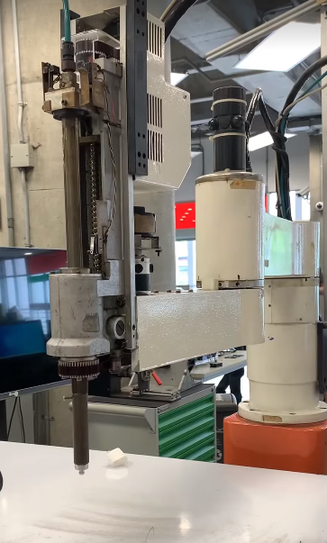

## **BRAZO ROBÓTICO CONTROLADO POR ROS 2**

# 1.1. Introducción

 

 
Un brazo robótico SCARA 4 DOF es un tipo de robot industrial utilizado para la automatización de procesos y la fabricación de artefactos. Esta máquina será controlada por una plataforma de código llamada ROS 2 que es una herramienta de desarrollo de software empleada en la robótica.

 

 

# 1.2. Descripción del proyecto 

   

 
Este documento explora las posibilidades de trabajar con un marco de robótica, concretamente ROS 2, para interconectar diversas posibilidades en este complejo ámbito. ROS 2 ofrece facilidad para conectar sistemas de detección y actuación, facilitando el procesamiento de datos para una mejor toma de decisiones y acelerando los procesos. La segunda versión de ROS 2 es la preferida, ya que recibirá los comentarios de los creadores, lo que la convertirá en el futuro del sector. ROS 2 también ofrece descentralización, permitiendo que múltiples nodos con la misma importancia trabajen juntos. Para sumergirse mejor en ROS, es esencial trabajar con un modelo físico, incluidos los microcontroladores y la visión robótica, utilizando el robot industrial que se encuentra en la Universidad EAFIT bloque 19 planta 2.

# 1.3. Objetivos de proyecto

 
-       Simular el robot industrial encontrado en el segundo piso del bloque 19 de la Universidad en el ambiente de simulación Gazebo 2.   
-       Tener un modelo preciso con respecto al original para tener una simulación concreta del robot.  
-       Crear las diferentes poses necesarias para tener un proceso industrial en la mesa de trabajo utilizando una máquina de estados finitos (MEF).   
-       Implementar la visión robótica en el equipo para mejorar la precisión del proceso.   

# 1.4. Etapas del proyecto

 
-       Proceso de modelado y simulación.  
-       Caracterización del robot SCARA.  
-       Conexión con ROS y Arduino.  
-       Visión robótica para procesos complejos.  

# Requisitos principales del proyecto

 
- Se requieren conocimientos básicos de _ROS 2_.  
- Herramientas de visualización gráfica como: _gazebo, rviz, moveit, entre otras.    

En el presente documento se encuentra la bitácora con todos los pasos para lograr el objetivo del proyecto, el repositorio de _github_ se encuentra a continuación:

[Repositorio Github](https://github.com/semillero-ares/ros2_scara.git) 
